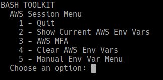
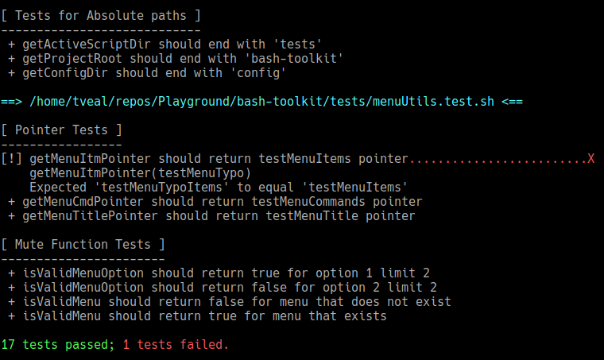

# Bash ToolKit

A configurable bash menu. This was developed for Ubuntu-flavored Linux ditros, but theoretically should work in any standard bash shell.



- [Setup](#setup)
- [AWS Session Tools](#aws-session-tools)
- [Menu Configuration](#menu-configuration)
- [Tests!](#tests)

## Setup

Create an alias in your bash profile. You could simply put this in your `~/.bashrc` file, or wherever you organize your bash aliases.

```
alias btk='. /path/to/bash-toolkit/btk.sh'
```
When you open a terminal, simply execute the `btk` alias, and follow the menu options as you wish. You may need to check/setup your aws config/credentials.

## AWS Session Tools

This toolkit includes some aws session tools, allowing you to easily check aws environment variables and establish a session with an mfa code.

Dependencies
- [jq](https://stedolan.github.io/jq/) - Command-ling JSON Parser
- `~/.aws/credentials` config

The mfa tool uses _non-default_ aws credentials to spawn a live session, storing session credentials in the _default_ profile. For example, your credentials file should look like this:
```
[example1]
aws_access_key_id = <key id for example1>
aws_secret_access_key = <key for example1>
mfa_serial = <mfa arn for example1>

[example2]
aws_access_key_id = <key id for example1>
aws_secret_access_key = <key for example1>
mfa_serial = <mfa arn for example1>
```
You **should not** have a `[default]` credential setup initially, as the mfa tool will override it with the live session. You do not need 2 credential sets such as example1 and example2 - this is just a sample for if you had more than 1. After running the mfa tool, this credentials file will have `[default]` properties, but keep in mind those properties will change next time you initialize with an mfa token. Ideally, the session creds should only be stored in the shell environment variables, but not all libraries and tools used with aws properly access the environment variables.

## Menu Configuration

To edit the menu options and functions, see the `config/menus.sh` file. Say you wanted to add a sub-menu; you can add code like the following to create a menu:

```
createMenu "mySubMenu" "My Sub Menu"
addMenuItem "mySubMenu" "Quit" l8r
addMenuItem "mySubMenu" "My fancy tool" fancyToolFunc
addMenuItem "mySubMenu" "My Easter Egg" easterEggFunc
```
Now add `mySubMenu` to the `mainMenu` so you have a way to load your new menu:
```
addMenuItem "mainMenu" "Go to My Sub Menu" loadMenu "mySubMenu"
```
Don't forget to define your new functions in `mySubMenu`:
```
function fancyToolFunc() {
    echo "TODO: do something fawncy here."
    pause
}

function easterEggFunc() {
    echo "  _  _   __  _   _    __  "
    echo " //_// //_  //  //  // // "
    echo "// // //_  //_ //_ //_//  "
    echo "~~~~~~~~~~~~~~~~~~~~~~~   "
    pause
}
```

## Tests!

Some-what of an Easter Egg - this project has a small collection of "bash unit tests". Bash is powerful, but commands and functions have ways of surprising you with the more you mesh together - the nature of building things. Write tests to check code sanity, rule in/out problem code, or to re-enforce functionality - especially in collaborative coding. Run the tests:
```
tests/runTests.sh
```
